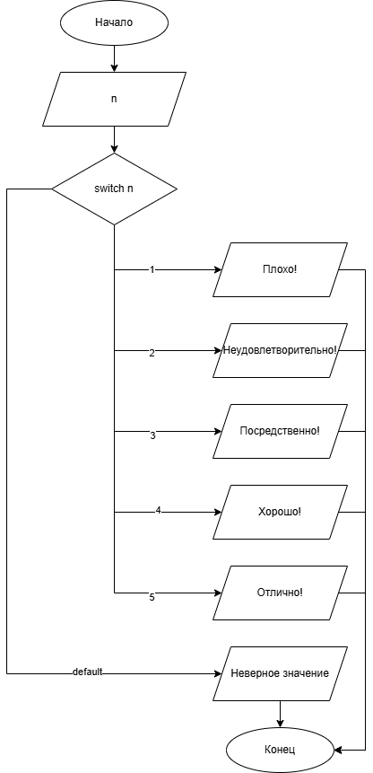

# Домашнее задание к работе 7

## Условие задачи
Составить программу, которая в зависимости от значения школьной оценки выводит словесное наименование ( плохо, неудовлетворительно, посредственно, хорошо, отлично).

## 1. Алгоритм и блок-схема

### Алгоритм
1. **Начало**
2. Инициализировать переменные:
   - `n` (int) - вводимая оценка.
3. Выполнение оператора `switch`: от вводимого числа зависит выбор `case`
4. Вывести текстовый ответ в зависимости от введенного числа
5. **Конец**

### Блок-схема
 

[https://github.com/glebofrl/lab6VSU/blob/master/scheme.png](https://github.com/glebofrl/lab7VSU/blob/master/scheme.png)

## 2. Реализация программы

```
#include <stdio.h>
#include <locale.h>
#include <math.h>
#define _USE_MATH_DEFINES
#define _CRT_SECURE_NO_DEPRECATE

int main()
{
	int n;

	setlocale(LC_CTYPE, "RUS");

	printf("Напишите полученную оценку в цифровом значениии: ");
	scanf("%d", &n);

	switch (n)
	{
	case 1: printf("Плохо!");
		break;

	case 2: printf("Неудовлетворительно!");
		break;

	case 3: printf("Посредственно!");
		break;

	case 4: printf("Хорошо!");
		break;

	case 5: printf("Отлично!");
		break;

	default: printf("Неверное значение");
		break;
	}

	return 0;

	system("pause");

}
```

## 3. Результаты работы программы


## 4. Информация о разработчике

Глебов Илья, бИПТ-252

